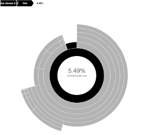

[discify](https://github.com/131/discify) is a browserify plugin that generatee graph and stats of your bundle. It'a lightweight alternative to [disc](https://github.com/hughsk/disc).

[](https://www.npmjs.com/package/discify)
[](http://opensource.org/licenses/MIT)



# What you'll get
* a /disc/ folder in your project root
* a /disc/index.html standalone, neat, manually crafter repport HTML graph
* a /disc/map.json file with also usefull informations

# API/usage
```
npm install --save-dev discify
browserify --node -p discify entry.js
# enjoy your /disc folder
```

# disc VS discify
* Simplier workflow ; as discify is a plugin, it access live and raw from browserify and does not need a dedicated "useFullPath"


# Credits / related
* [disc](https://github.com/hughsk/disc) : design inspiration
* [browserify](https://github.com/substack/browserify) packaging wizard flow
* [d3](https://d3js.org/) graph library
* [131](https://github.com/131) - Author